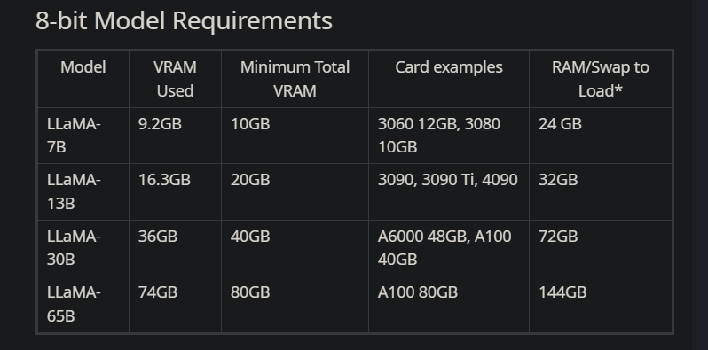
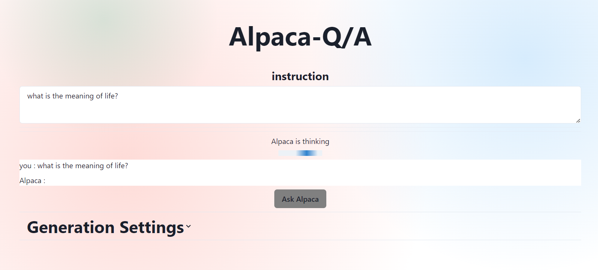
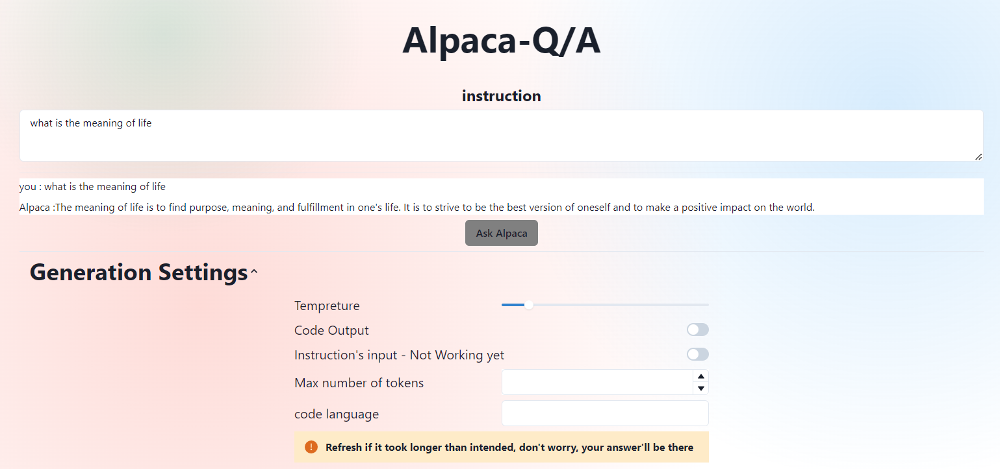
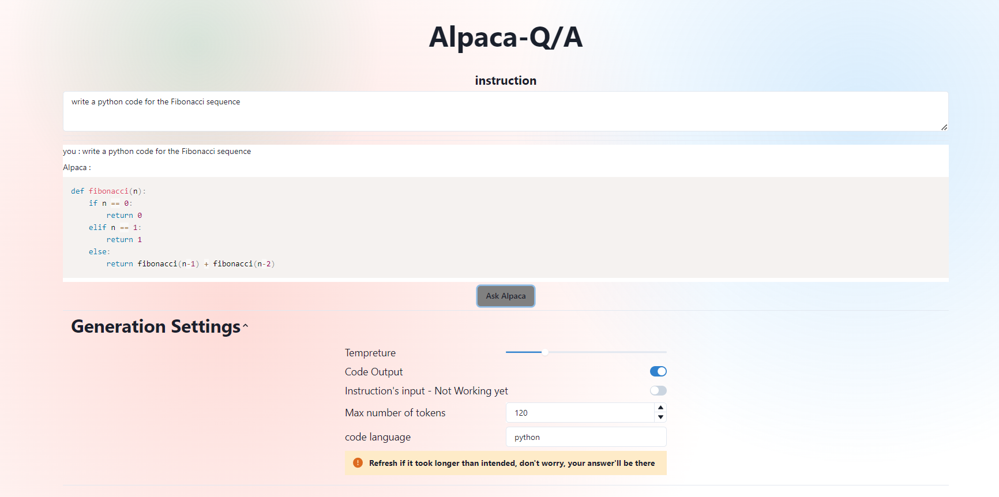
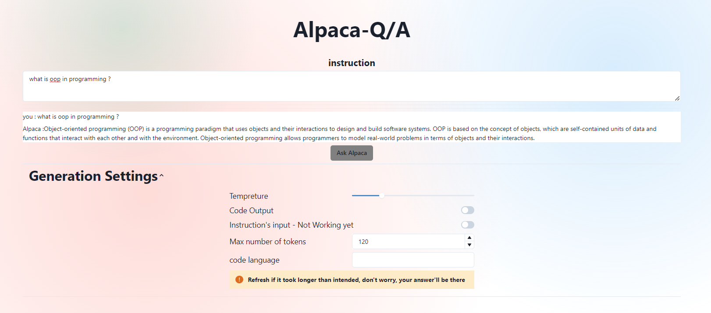

# Alpaca Q/A 
 Simple Q/A app, where I created a UI for alpaca (fine tuned LLAMA) model with Pynecone and hosted on Google Colab
 
 Test it on the notebook [here](alpacaQ&A.ipynb), please give alpaca a time to think, thank you.

## Table of Contents
- [Alpaca Q/A](#alpaca-qa)
  - [Table of Contents](#table-of-contents)
  - [What is Alpaca? LLAMA ?](#what-is-alpaca-llama-)
  - [What is this repo about?](#what-is-this-repo-about)
  - [Tools used](#tools-used)
  - [Project Steps](#project-steps)
  - [Overview](#overview)
  - [Furthur Notes](#furthur-notes)
  - [Disclaimer](#disclaimer)
  - [Known Issues](#known-issues)
  - [Future Work](#future-work)

## What is Alpaca? LLAMA ? 
- [LLAMA](https://github.com/facebookresearch/llama) is a large langauge model developed and created by Facebook AI Research. aka META.
- LLAMA Models has 4 different sizes 7, 13, 30, 65 Billions parameters, the 13B Benchmarked GPT-3 models which have 175 Billion parameters, check out their [cool paper](https://arxiv.org/abs/2302.13971)
- Check out [Dalai](https://github.com/cocktailpeanut/dalai) ,  [cocktailpeanut](https://github.com/cocktailpeanut) managed to create a guide on how to use LLAMA models on your own Local machine, it's great and always underdevelopment, for other options check out [this](https://www.reddit.com/r/LocalLLaMA/comments/11o6o3f/how_to_install_llama_8bit_and_4bit/) reddit post.
- [ALPACA](https://github.com/tatsu-lab/stanford_alpaca) is a fine tuned version of LLAMA model created by stanford, which is trained on a dataset of 52k instructions that were passed to `text-davinci-003` of open AI,  basically it was the teacher model for the LLAMA model.
- more on ALPACA and low rank adapatation [here](https://github.com/tloen/alpaca-lora/)

## What is this repo about?
- It's about creating a simple Q/A app, where you can ask questions and get answers from the ALPACA model, it's hosted on Google Colab, so you don't need to install anything, just run the notebook and you're good to go. 
- it's a simple app as Tesla T4 GPU is not that powerful, I used a 8bit Quantized version of the 7B model, which holds half of the memory used by the normal LLAMA 7B model, that makes it's enough to run the ALpaca model.
- more on GPT Quantization [here](https://github.com/IST-DASLab/gptq)
- 8bits quantization and RAM from the previously mentioned subreddit [post](https://www.reddit.com/r/LocalLLaMA/comments/11o6o3f/how_to_install_llama_8bit_and_4bit/), which is has a great overview of the LLAMA models and how to use them.
  

## Tools used
- Google Colab
- [Pynecone](https://github.com/pynecone-io/pynecone) - full-stack Python framework
- [Localtunnel](https://www.npmjs.com/package/localtunnel) - which i used to connect the backend to the frontend.
- Huggieface - for the pretrained model and it's tokenizer, 7b model [here](https://huggingface.co/chainyo/alpaca-lora-7b)

## Project Steps
1. Load required libraries
2. intialize the Pynecone app
3. create Frontend and Backend URLs using LocalTunnel
   - here's a Quick Guide on how I created a simple app using Pynecone and LocalTunnel on Google Colab [here](https://medium.com/@Andrew.Naeem/create-and-host-pynecone-application-on-google-colab-b7b6dbc8b489) 
4. Create the Application, rewriting the following command
> %%writefiles 
5. Connect Frontend to Backend using LocalTunnel URLs
6. wait for the model to load and app to compile, takes about 6-7 minutes

## Overview
1. simple interface, where you can ask questions and get answers from the ALPACA model
   

2. few examples

1. test it yourself [AlpacaQ/A](alpacaQ&A.ipynb) 

## Furthur Notes
- it's slow compared ChatGPT, don't get your hopes up
- be patient.
- Settings are self-explanatory just hover over it.
- it's can be dockerized, but keep in mind that it's Opensource and free.
- make sure to connect to a GPU runtime, it will not load the model after downloading it.
- you can run it locally on your machine, if you have strong GPU Beffy GPU, i suggest Creating Conda Enviroment for such a task.
- [model](model.ipynb) contains the simple implementation of the model
- [app](app.ipynb) contains the code for the app created using Pynecone
## Disclaimer
- I didn't create the model, I just created a simple app for it, and I figured out a way to host the app on colab.
- Yes, localtunnel exposes your instance and you can use it over your phone sharing Urls will cause problems, as i haven't created a database for it yet, neither it can take parallel command.
- I do understand that it's not the best way to host it, but it's free and easy to use, you dont have to download anything, on your machine to test it out.just run the notebook and you're good to go.
- What i did is not a machine learning enigneering task. I just understand how it works, I don't posses the abilty to fine tune it, or create a better model. as such task needs a beefy machine, and a lot of time.

## Known Issues
- **Loading-Bug,** some times you'll have to refresh the page to get the answer, it's a known issue, and I'm working on it.
- **Halucinations**, that's why Stanford had taken it down, right now some people were assuming that that's an issues with the dataset and are trying to update it, once something better is out i will update the model.

## Future Work
- Handel instruction's Input - still working on a better way to 
- database for the questions and answers 

ALL the credit should go to the creators of the model, and the people who worked on it, Thanks stanford and Facebook AI Research.
